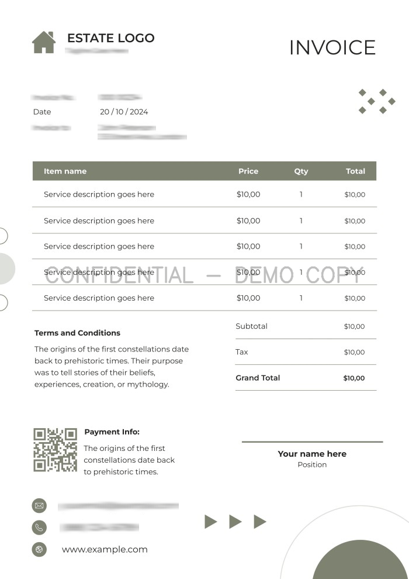
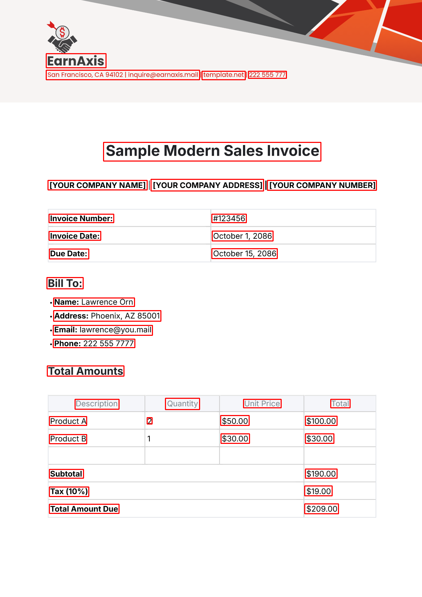
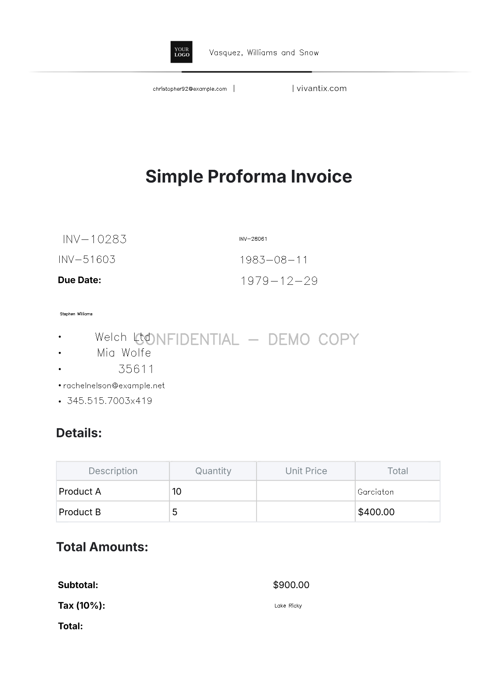

# Invoice Privacy Masker

<p align="center">
	
</p>

<p align="center">
	
	
	
</p>

Invoice Privacy Masker detects sensitive fields in invoices using OCR + NER and produces masked (blurred) images. It also supports optional redaction with dummy text, step-by-step outputs, and tokenized restoration workflows.

## Features
- OCR with EasyOCR
- NER with spaCy or Hugging Face
- Masking (blur) with optional watermark
- Optional redaction, step outputs, and tokenized restore
- FastAPI UI and API

## Requirements
- Python 3.10+ recommended
- System dependencies for `pdf2image` (Poppler) if you process PDFs

## Setup
```bash
python -m venv .venv
.venv\Scripts\activate
pip install -r invoice_masker\requirements.txt
```

Download the spaCy model if using the default NER backend:
```bash
python -m spacy download en_core_web_sm
```

## Environment
Optional environment variables (see .env.example):
- INVOICE_MASKER_CONFIG: path to a custom config YAML

## CLI usage
Run from the `invoice_masker` directory:
```bash
cd invoice_masker
python main.py --input path\to\invoice.png
```

Common options:
```bash
python main.py --input path\to\invoice.pdf --save-ocr-boxes --save-steps --save-dummy --save-tokenized
```

## API usage
From the `invoice_masker` directory:
```bash
cd invoice_masker
uvicorn api:app --reload
```

Open http://127.0.0.1:8000 to use the UI. The API endpoints include:
- `POST /mask`
- `POST /restore`
- `POST /upload`

## Configuration
Edit `invoice_masker/config.yaml` to tune OCR, NER, masking, watermarking, and output paths.

## Outputs
Generated files are written under:
- `outputs/`
- `outputs_ocr/`
- `outputs_steps/`
- `outputs_redacted/`
- `outputs_tokenized/`
- `outputs_restored/`

These outputs are tracked in this repo for demo purposes.

## Deployment notes
- Set `INVOICE_MASKER_CONFIG` to point at your production config if needed.
- For production, run uvicorn with explicit host/port and workers, for example:
```bash
uvicorn api:app --host 0.0.0.0 --port 8000 --workers 2
```

## Docker
Build and run with Docker:
```bash
docker build -t invoice-masker .
docker run --rm -p 8000:8000 invoice-masker
```

Or with docker-compose:
```bash
docker-compose up --build
```
